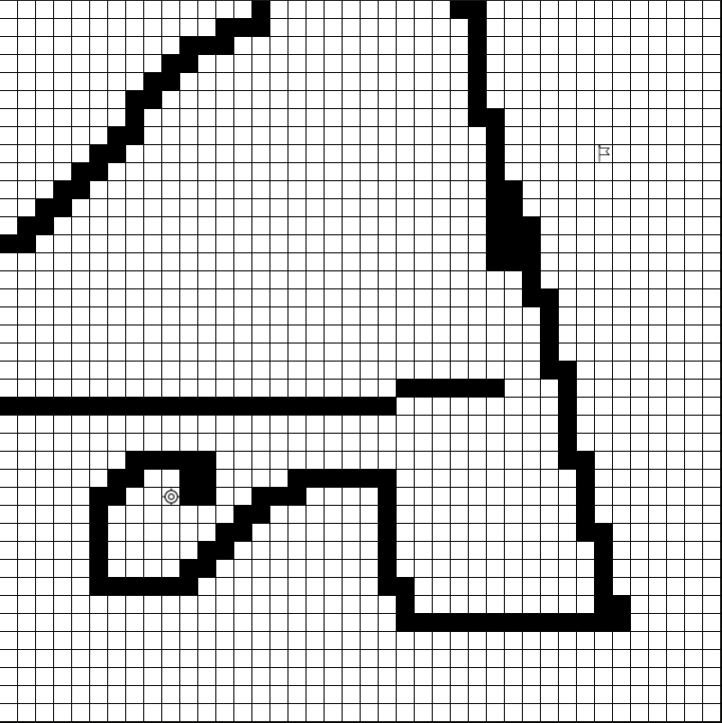
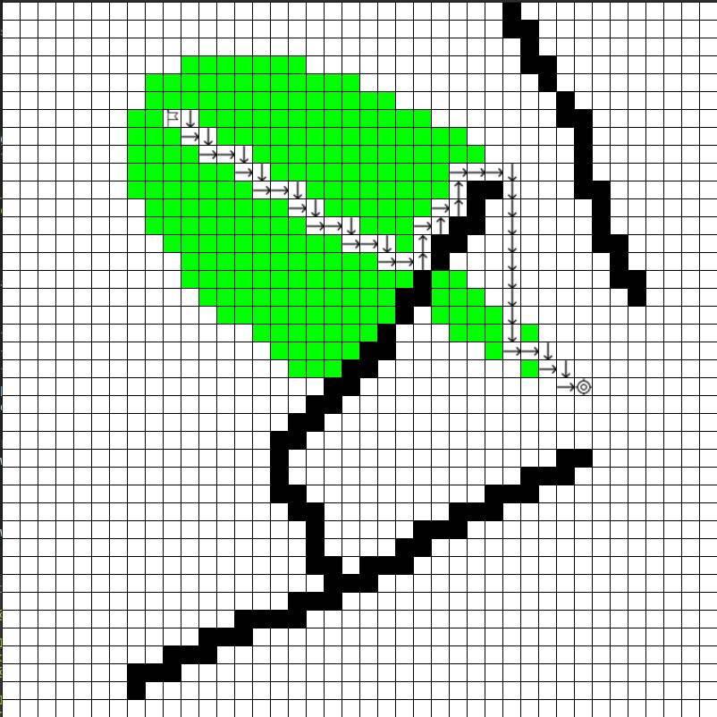

# Pathfinding algorithms visualizer

This is a visualizer for the most popular pathfinding algorithms.

This app was made with [Python 3.8](https://www.python.org/), [Pygame](https://www.pygame.org/news) and [Tkinter](https://wiki.python.org/moin/TkInter). Most of the project was done using basic Python. Pygame was used for GUI and Event Handling and Tkinter was used for additional windows that pop-up.

## Features

This app supports visualizing 4 algorithms:

1. [BFS](https://en.wikipedia.org/wiki/Breadth-first_search)
2. [DFS](https://en.wikipedia.org/wiki/Depth-first_search)
3. [A*](https://en.wikipedia.org/wiki/A*_search_algorithm)
4. [Greedy Best-first Search](https://en.wikipedia.org/wiki/Best-first_search)

In the home screen you have two buttons: "Start" and "How to use".
"Start" button starts the app, while by pressing "How to use" button a window with instructions pops-up.

## Demo images

## Requirements

In order to play you have got to first install:

1. [Python3](https://docs.python-guide.org/starting/install3/linux/)

2. [Pygame](https://www.pygame.org/wiki/GettingStarted)

3. [Tkinter](https://stackoverflow.com/questions/4783810/install-tkinter-for-python)

The installation varies from distribution to distribution. Hopefully the links from above are useful to you.

## How to run

1.Open the main directory of the project (in here you should find a file called "run.sh")

2.Open the terminal in the current directory

3.Run the command "./run.sh"

## Demo video

https://youtu.be/0kW3_m82UUE

## Final notes

I hope you enjoy playing this Pathfinding algorithms visualizer.

If you find any bugs, feel free to submit them to blahoviciandrei1@gmail.com